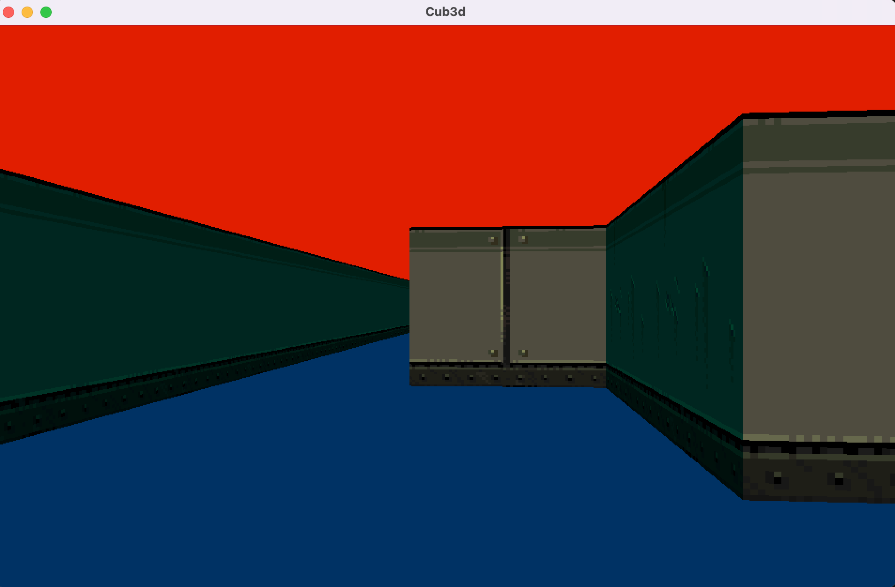

# Cub3D

This purpose of this project is to create a “realistic” 3D graphical
representation of the inside of a maze from a first-person perspective  using raycasting principles. 

## Usage

Here are the instructions in order to compile the program:

| Command | Usage |
| --- | --- |
| `make` | Compiles program and creates executable ./cub3d 
| `make clean` | Removes all object files (.o) of project and from libft
| `make fclean` | Removes all objects files (.o), all .a along with executable ./cub3d
| `make re` | Removes all objects (.o) files and executable and recompiles them

The program takes a map as an argument under the format .cub

```shell
./minishell mapfiles/<nameOfMap>
```	

## Important Commands

| Command | Usage |
| --- | --- |
| `W` | Move forward
| `A` | Move left
| `S` | Move downward
| `D` | Move right
| `<-` | Rotate camera on the left
| `->` | Rotate camera on right. 


## Contribution

This project was realized with [anasilvr](https://github.com/anasilvr)

## Demo


